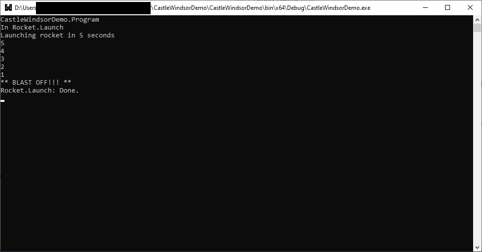
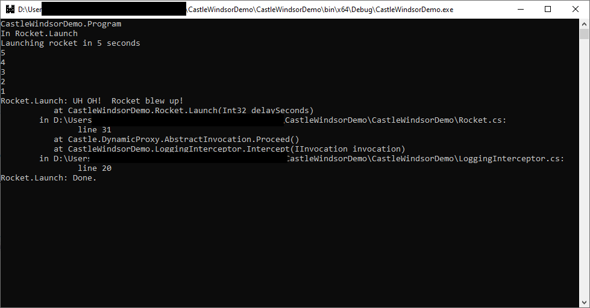

# CastleWindsorDemo

This program was created by me in order to learn more about the Castle.Windsor dependency-injection (DI) framework.  In this project, we are developing it while following along with the Aspect Oriented Programming (AOP) in C# using Castle DynamicProxy article on The Code Project, at: https://www.codeproject.com/Articles/1083684/Aspect-Oriented-Programming-AOP-in-Csharp-using-Ca.

## 1. Introduction

In this tutorial, we are going to build a rocket-launching system.  This is what the console app will do when it's executed afer we are done adding code:



When the user starts the application, the system will initiate a 5-second count-down, and print `** BLAST OFF!! **` on the screen when the rocket launches.

This is what the app will do when we throw an exception on purpose:



As you can see, this application has robust logging and exception-handling.

One of the use cases for `Castle.Windsor` is to provide ways to not have to write this boilerplate code for all the methods in  your entire software system (see the [CodeProject Article](https://www.codeproject.com/Articles/1083684/Aspect-Oriented-Programming-AOP-in-Csharp-using-Ca) for more).

We will then utilize Aspect-Oriented Programming and `Castle.Windsor` in order to add logging to our rocket class.

This article assumes that readers already know the basics of using Inversion-of-Control (IoC) and DI frameworks and containers.

I am not trying to copy or re-hash the CodeProject article referenced above --- I do want to give credit where credit is due.  This sample is not my original work.  However, I have adapted and improved on the article's code here and there.

I also believe that this article is more of a 'walkthrough-style' article than the one posted on the Code Project; in my view, this presents an alternative way of presenting the tutorial.  Whereas the Code Project article goes way more in depth as to _why_ the code works as it does, this article talks about specifically _how_, step by step, I went about implementing this solution, along with my own understanding of how all the pieces fit together. 

## 2. Implementation Steps

### 2.1. Create demo Console App.

1. Open Visual Studio 2019.

2. Click the **File** menu, point to **New** and then click **Project**.

3. In the **Create a New Project** window, select `Console App (.NET Framework)` as the project type, and then click **Next**.

4. In the ***Configure Your New Project** window, type `CastleWindsorDemo` in the **Project Name** box.

5. In the **Framework** drop-down, select `.NET Framework 4.8`.

6. Choose other settings as appropriate.

7. Click **Create**.

### 2.2. Add the `Castle.Windsor` NuGet package to the `CastleWindsorDemo` project.

1. In **Solution Explorer**, right-click the project, and then click **Manage NuGet Packages**.

2. In the **NuGet: CastleWindsorDemo** tab in Visual Studio, click **Browse**, and type `Castle.Windsor` in the **Search** box.

3. Click the `Castle.Windsor` package icon, and then click **Install**.

4. Close the **NuGet: CastleWindsorDemo** tab.

### 2.3. Create the `IRocket` interface.

1. In Visual Studio, open the **Solution Explorer** window.

2. In **Solution Explorer**, right-click the `CastleWindsorDemo` project, point to **Add**, and then click **Class**.

3. In the **Add New Item - CastleWindsorDemo** dialog box, click `Interface` in the list in the middle, and then type `IRocket.cs` in the **Name** text box.  Click the **Add** button when finished.

4. Replace the code in the new `IRocket.cs` file with the following:

```
namespace CastleWindsorDemo
{
    /// <summary>
    /// Describes the public interface of a rocket object.
    /// </summary>
    public interface IRocket
    {
        /// <summary>Launches the rocket after a countdown specified 
        /// by the <paramref name="delaySeconds" /> parameter.
        /// </summary>
        /// <param name="delaySeconds">
        /// (Required.) Number of seconds to
        /// count down before launching the rocket.
        /// </param>
        /// <exception cref="T:System.ArgumentOutOfRangeException">
        /// Thrown if <paramref name="delaySeconds" /> is zero or negative.
        /// </exception>
        void Launch(int delaySeconds);
    }
}
```

Next, we are going to implement this interface with a concrete type `Rocket`.  The `Rocket` class imoplements the `IRocket` interface.

### 2.4. Create the `Rocket` class.

1. In Visual Studio, open the **Solution Explorer** window.

2. In **Solution Explorer**, right-click the `CastleWindsorDemo` project, point to **Add**, and then click **Class**.

3. In the **Add New Item - CastleWindsorDemo** dialog box, click `Class` in the list in the middle, and then type `Rocket.cs` in the **Name** text box.  Click the **Add** button when finished.

4. Replace the code in the new `Rocket.cs` file with the following:

```
using System;
using System.Threading;

namespace CastleWindsorDemo
{
    /// <summary>Concrete implementation of a rocket.</summary>
    public class Rocket : IRocket
    {
        /// <summary>
        /// Gets or sets a string containing the model of the rocket.
        /// </summary>
        public string Model { get; set; }

        /// <summary>
        /// Gets or sets a string containing the name of the rocket.
        /// </summary>
        public string Name { get; set; }

        /// <summary>
        /// Launches the rocket after a countdown specified by the
        /// <paramref name="delaySeconds" /> parameter.
        /// </summary>
        /// <param name="delaySeconds">
        /// (Required.) Number of seconds to count down before launching the rocket.
        /// </param>
        /// <exception cref="T:System.ArgumentOutOfRangeException">
        /// Thrown if <paramref name="delaySeconds" /> is zero or negative.
        /// </exception>
        public void Launch(int delaySeconds)
        {
            if (delaySeconds <= 0)
                throw new ArgumentOutOfRangeException(nameof(delaySeconds));

            Console.WriteLine("Launching rocket in {0} seconds", delaySeconds);
            for (var i = delaySeconds; i > 0; i--)
            {
                Console.WriteLine(i);
                Thread.Sleep(1000);
            }

            // uncomment this line to test invocator exception handling
            // throw new InvalidOperationException("UH OH!  Rocket blew up!");

            Console.WriteLine("** BLAST OFF!!! **");
            Thread.Sleep(1000);
        }
    }
}
```

**NOTE:** The `Rocket` class and its `IRocket` itnerface are meant to be only toy objects that are used in our DI framework examples.

Now, we move on to write a so-called _interceptor_ class.  This class will sit in between the caller and the callee of methods of objects that the interceptor is registered for in the DI container.

The interceptor, `LoggingInterceptor` will implement the `Castle.DynamicProxy.IInterceptor` interface, and, as the name implies, will provide services to address a **Logging** cross-cutting concern.

### 2.5. Create the `LoggingInterceptor` class.

1. In Visual Studio, open the **Solution Explorer** window.

2. In **Solution Explorer**, right-click the `CastleWindsorDemo` project, point to **Add**, and then click **Class**.

3. In the **Add New Item - CastleWindsorDemo** dialog box, click `Class` in the list in the middle, and then type `LoggingInterceptor.cs` in the **Name** text box.  Click the **Add** button when finished.

4. Replace the code in the new `LoggingInterceptor.cs` file with the following:

```
using System;
using Castle.DynamicProxy;

namespace CastleWindsorDemo
{
    /// <summary>
    /// Intercepts method entry, exit, and exception
    /// occurrence to log messages to the console.
    /// </summary>
    public class LoggingInterceptor : IInterceptor
    {
        /// <summary>
        /// Called when intercepted DynamicProxy calls
        /// are made to program class' methods.
        /// </summary>
        /// <param name="invocation">
        /// Reference to an instance of an object that implements
        /// the <see cref="T:Castle.DynamicProxy.IInvocation" /> interface.
        /// </param>
        /// <remarks>
        /// This method can be used to intercept the entry, exit,
        /// and exception-thrown scenarios of a method call.
        /// </remarks>
        public void Intercept(IInvocation invocation)
        {
            var methodClassFqn =
                $"{invocation.InvocationTarget.GetType().Name}.{invocation.Method.Name}";

            try
            {
                Console.WriteLine($"In {methodClassFqn}");
                invocation.Proceed();
            }
            catch (Exception e)
            {
                Console.WriteLine(
                    $"{methodClassFqn}: {e.Message}\n\t{FormatExceptionStackTrace(e.StackTrace)}"
                );
                throw;
            }
            finally
            {
                Console.WriteLine($"{methodClassFqn}: Done.");
            }
        }

        private static string FormatExceptionStackTrace(string stackTrace) =>
            string.IsNullOrWhiteSpace(stackTrace)
                ? stackTrace
                : stackTrace.Replace("\n", "\n\t").Replace(" in ", "\n\tin ")
                    .Replace(".cs:line", ".cs:\n\t\tline");
    }
}
```

As we can see in the code listing above, the `Intercept` method is a method that appears to obviously be triggered anytime a properly-regeistered (with the DI container) caller makes a method call on a (also properly-registered) callee.

The `invocation.Proceed()` call is the placeholder for calling the method itself.  Our `try`/`catch` block allows us to trap exceptions and then we can handle them any way we wish.  The aspect takes care of weaving this flow structure in any properly-registered object.

To set up this association, we implement the `Castle.MicroKernel.Registration.IRegistration` interface.  We next make a class to do just that.

I know that the following terminology is not exactly jargon in the DI/IoC world, but I like to think of `Castle.Windsor`'s `Interceptor`s as an implementation of _runtime-weaving_ in aspect-oriented programming frameworks.

DI frameworks such as `PostSharp` and (I assume) `Spring.NET` -- although I cannot say for certain, as I have never used `Spring.NET` in any of my projects -- do _complle-time weaving_, wherein you decorate objects and methods with attributes and then, during compilation, extra code is then added to your assembly to make it do cross-cutting logging or validation etc.  

I call `Castle.Windsor`'s `DynamicProxy`-based approach a _runtime weaving_ implementation since the dynamic proxy functions, in effect, to weave the aspect and the object together by dint fo the way it sits in between the caller and callee, and its functionality is specified purely by registration code.  The "weaving" (and I am using the term loosely) only really takes place during runtime.

### 2.6. Associate objects with interceptors in a `ComponentRegistration` class.

1. In Visual Studio, open the **Solution Explorer** window.

2. In **Solution Explorer**, right-click the `CastleWindsorDemo` project, point to **Add**, and then click **Class**.

3. In the **Add New Item - CastleWindsorDemo** dialog box, click `Class` in the list in the middle, and then type `ComponentRegistration.cs` in the **Name** text box.  Click the **Add** button when finished.

4. Replace the code in the new `ComponentRegistration.cs` file with the following:

```
using Castle.Core;
using Castle.MicroKernel;
using Castle.MicroKernel.Registration;

namespace CastleWindsorDemo
{
    /// <summary>
    /// Implements the <see cref="T:Castle.MicroKernel.Registration.IRegistration" />
    /// interface.
    /// </summary>
    /// <remarks>This class does the connection between
    /// interceptors and the objects they work on.
    /// </remarks>
    public class ComponentRegistration : IRegistration
    {
        /// <summary>
        /// Associates project classes with interceptors.
        /// </summary>
        /// <param name="kernel">
        /// (Required.) Reference to an instance of an
        /// object that implements the <see cref="T:Castle.MicroKernel.IKernelInternal" />
        /// interface.  This object provides access to the Castle.Windsor library
        /// functionality.
        /// </param>
        public void Register(IKernelInternal kernel)
        {
            kernel.Register(
                Component.For<LoggingInterceptor>()
                    .ImplementedBy<LoggingInterceptor>()
            );

            kernel.Register(
                Component.For<IRocket>().ImplementedBy<Rocket>().Interceptors(
                    InterceptorReference.ForType<LoggingInterceptor>()
                ).Anywhere
            );
        }
    }
}
```

The first step is to implement the `IRegistration.Register` method.  This method is provided a `IKernelInternal` reference as its sole parameter.  It is through the object referneced by this parameter that you not only register objects (and the interfaces they implement) with the DI controller, but also any interceptors you wish to utilize.

The first statement in the body of the `IRegsitration.Register` method simply registers the `LoggingInterceptor` class with the DI framework.

The next statement tells the DI framework that the `Rocket` class implements the `IRocket` interface and that its method calls should be intercepted by a `LoggingInterceptor`, anywhere they are made in the code.

### 2.7. Create a static `DependencyResolver` class to be a service locator for the DI container.

1. In Visual Studio, open the **Solution Explorer** window.

2. In **Solution Explorer**, right-click the `CastleWindsorDemo` project, point to **Add**, and then click **Class**.

3. In the **Add New Item - CastleWindsorDemo** dialog box, click `Class` in the list in the middle, and then type `DependencyResolver.cs` in the **Name** text box.  Click the **Add** button when finished.

4. Replace the code in the new `DependencyResolver.cs` file with the following:

```
using Castle.Windsor;

namespace CastleWindsorDemo
{
    /// <summary>
    /// Provides functionality to resolve injected dependencies.
    /// </summary>
    public static class DependencyResolver
    {
        /// <summary>
        /// Reference to an instance of an object that implements the
        /// <see cref="T:Castle.Windsor.IWindsorContainer" /> interface.
        /// </summary>
        /// <remarks>
        /// This object serves as the Dependency Container.
        /// </remarks>
        private static IWindsorContainer _container;

        /// <summary>
        /// Initializes the IoC container.
        /// .</summary>
        public static void Initialize()
        {
            _container = new WindsorContainer();
            _container.Register(new ComponentRegistration());
        }

        /// <summary>
        /// Resolves types for the object or interface
        /// <typeparamref name="T" />.
        /// </summary>
        /// <typeparam name="T">
        /// (Required.) Type to resolve dependencies for.
        /// </typeparam>
        /// <returns>
        /// Reference to an instance of the component of type
        /// <typeparamref name="T" />.
        /// </returns>
        public static T Resolve<T>() => _container.Resolve<T>();
    }
}
```

### 2,8. Consuming the `DependencyResolver` in the program in order to do useful operations.

This class is consumed in the `Program.Main` method of the console app as follows:

```
using System;

namespace CastleWindsorDemo
{
    /// <summary>
    /// Provides functionality for the program entry point.
    /// </summary>
    /// <remarks>This program was created by me in order to learn more
    /// about the Castle.Windsor dependency-injection (DI) framework.  In this
    /// project, we are developing it while following along with the Aspect Oriented
    /// Programming (AOP) in C# using Castle DynamicProxy article on The Code Project,
    /// at: https://www.codeproject.com/Articles/1083684/Aspect-Oriented-Programming-AOP-in-Csharp-using-Ca.
    /// </remarks>
    public static class Program
    {
        /// <summary>
        /// Initializes static data or performs actions that need to be performed
        /// once only for the <see cref="T:CastleWindsorDemo.Program" /> class.
        /// </summary>
        /// <remarks>
        /// This constructor is called automatically prior to the first
        /// instance being created or before any static members are
        /// referenced.
        /// </remarks>
        static Program() =>
            // Initialize the DependencyResolver
            DependencyResolver.Initialize();

        /// <summary>Entry point of the application.</summary>
        /// <param name="args">(Optional.) Array of strings, one per value passed on the command line of this application.</param>
        [STAThread]
        public static void Main(string[] args)
        {
            Console.WriteLine(typeof(Program).FullName);

            // resolve the type Rocket
            var rocket = DependencyResolver.Resolve<IRocket>();

            // try to launch the rocket
            try
            {
                rocket.Launch(5);
            }
            catch
            {
                // Ignored.
            }

            Console.ReadKey();
        }
    }
}
```

Note how we call `DependencyResolver.Initialize()` in the static constructor of the `Program` class.  This type of constructor is called only once in the lifetime of the application, so it is the perfect spot for us to initialize our DI container.

**NOTE:** I want to be sure to emphasize the takeaway of all this.  We write our logging boilerplate just once, in the `LoggingInterceptor` class.  

Then, we create our business object -- in this case, a `Rocket` object for a video game, and its `IRocket` interface, and in the `Rocket.Launch()` method we are worrying about only coding our desired functionality.  The rest of the code, for logging etc., is injected when we set up the association between our `Rocket` object, the `IRocket` interface it implements, and the `LoggingInterceptor` in the `ComponentRegistration.Register()` method implementation.

# 3. Building and running

Now that we've created the files and classes above, it's time to test our software.

1. In Visual Studio, type the `F5` key on your keyboard.
    - This has the effect of building the software and then executing the resulting `CastleWindsorDemo.exe` file.

2. If the program compiled, you should see the following output:


Notice how the entry into the `Rocket.Launch` method, its execution, and its completion are logged.